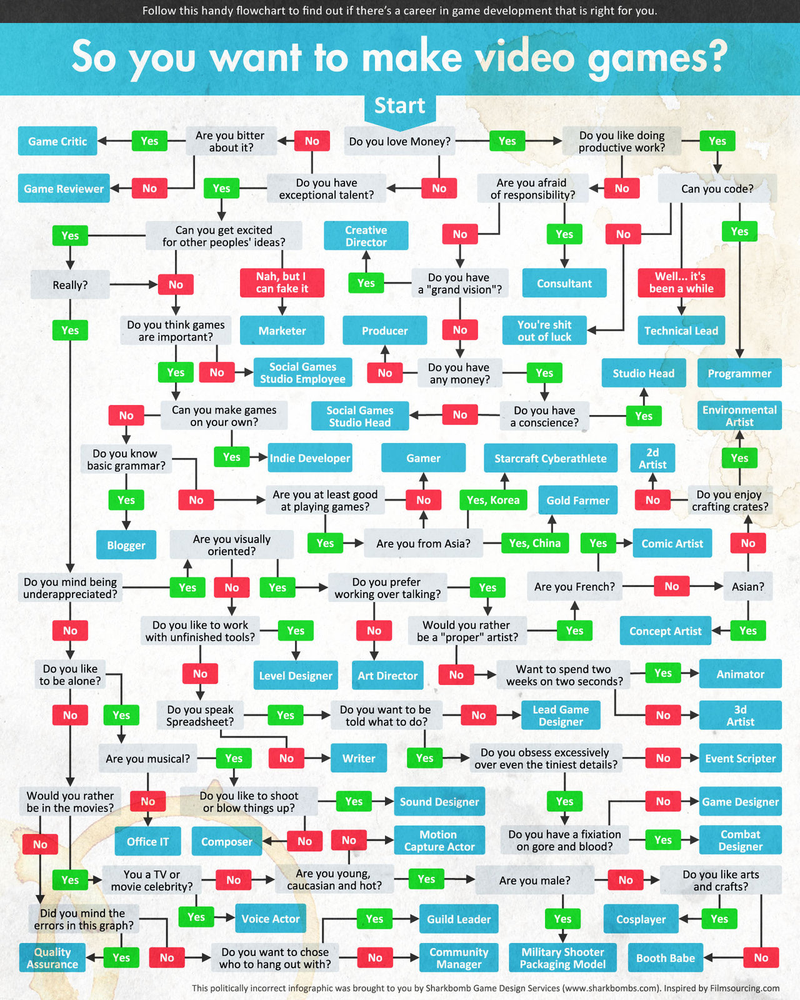

## GameDesignServicesChoose

### Autorzy
Maciej Kowalski 156010  
Paweł Waligóra 155972 

### Użycie

Używaniy język - `python`  

Potrzebne biblioteki zanjdują się w pliku `requirements.txt`  

```
pip install -r requirements.txt
```

Na niektórych systemach operacyjnych wymagane jest zainstalowanie pakietu `tkinter`   
np.
```
apt install tkinter
```

Uruchamiamy   
```
python main.py
```

Uwaga! Na chwilę obecną biblioteka `clipspy`  
NIE wspiera pythona `3.13.x+`  

Podczas tworzenia aplikacji użyto wersji pythona `3.10.12`

### Schemat

